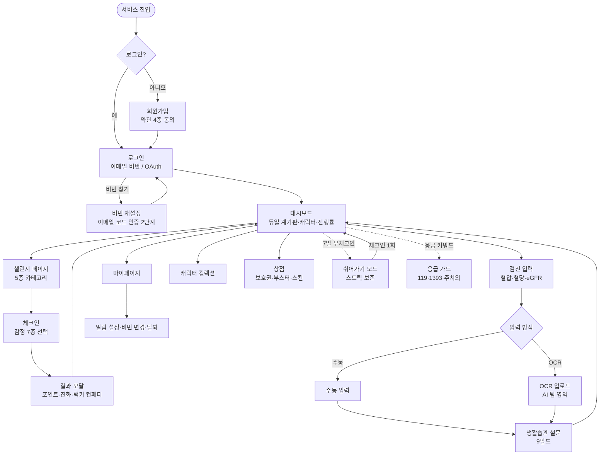
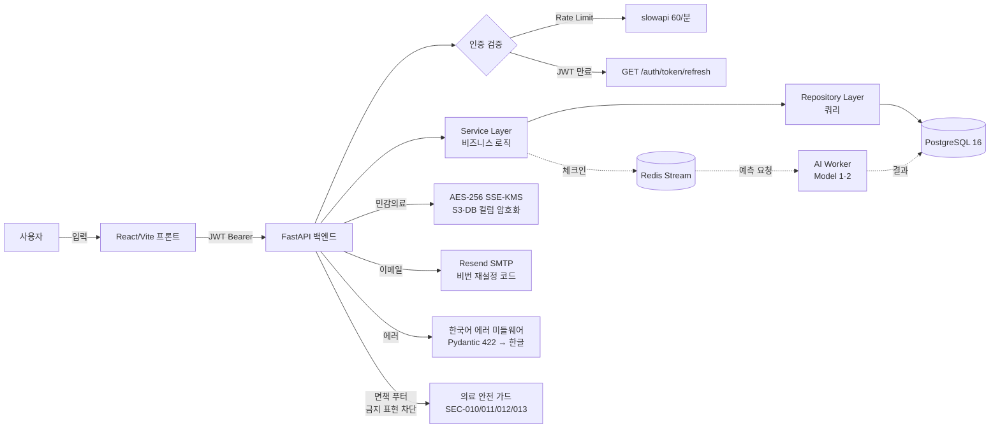

# 화면 흐름도 (Screen Flow)

> 사용자가 회원가입부터 챌린지 완전체 진화까지 거치는 전체 여정.
> 모든 핵심 기능은 **로그인 후 3~5단계 이내**에 접근 가능 (평가 4-1·4-3).

---

## 1. 전체 여정 (User Journey)



---

## 2. 핵심 흐름 — 메뉴 접근 단계 분석 (평가 4-3)

| 목표 화면 | 진입 단계 | 단계 수 |
|---|---|---|
| **대시보드** | 로그인 → 대시보드 | **1단계** ✅ |
| **체크인** | 대시보드 → 챌린지 → 체크인 | **3단계** ✅ |
| **컬렉션 (캐릭터)** | 대시보드 → TopNav 컬렉션 | **2단계** ✅ |
| **상점** | 대시보드 → TopNav 상점 | **2단계** ✅ |
| **마이페이지** | 대시보드 → TopNav 마이 | **2단계** ✅ |
| **알림 설정** | 대시보드 → 마이 → 알림 설정 | **3단계** ✅ |
| **비밀번호 변경** | 대시보드 → 마이 → 비번 변경 | **3단계** ✅ |
| **쉬어가기 모드** | 대시보드 → 캐릭터 카드 → 쉬어가기 | **3단계** ✅ |
| **응급 가드** | 어디서나 직접 진입 (`/emergency`) | **1단계** ✅ |

→ **모든 핵심 기능 3~5단계 이내** 충족 (REQ-UX, 평가 4-1·4-3)

---

## 3. 데이터 흐름 (Data Flow)



---

## 4. 페이지 인벤토리 (현재 v1.0)

총 **30개 페이지** 구현:

### 공개 (인증 불필요)
1. `/` LoginPage — 로그인 + 비번 찾기 모달 (2단계)
2. `/signup` SignupPage — 회원가입 + 동의 체크박스 4종
3. `/email-verify` EmailVerifyPage
4. `/oauth/callback` OAuthCallbackPage

### 인증 필요 — 핵심
5. `/dashboard` DashboardPage — 8종 위젯
6. `/challenge` ChallengeMainPage
7. `/daily-checkin` DailyCheckinPage — 감정 듀얼 축
8. `/collection` CollectionPage — 5종 캐릭터 모음
9. `/shop` ShopPage — 보호권·부스터·스킨
10. `/rest-mode` RestModePage — 쉬어가기 모드

### 검진·설문
11. `/ocr-upload` OCRUploadPage
12. `/ocr-result` OCRResultPage
13. `/manual-input` ManualInputPage
14. `/lifestyle-survey` LifestyleSurveyPage (9필드)
15. `/diet-survey` DietSurveyPage
16. `/health-check-history` CheckupHistoryPage

### 마이페이지·설정
17. `/mypage` MyPage — 비번 변경·탈퇴
18. `/notification-settings` NotificationSettingsPage
19. `/notifications` NotificationListPage

### 게이미피케이션
20. `/egg-hatching` EggHatchingPage (부화 시연)
21. `/slump` SlumpPage
22. `/points/transactions` PointHistoryPage

### 콘텐츠
23. `/daily-quiz` DailyQuizPage
24. `/social-group` SocialGroupPage
25. `/family-cheer` FamilyCheerPage
26. `/dining-mode` DiningModePage
27. `/rag-chatbot` RAGChatbotPage
28. `/simulation` SimulationPage
29. `/llm-guide` LLMActionGuidePage
30. `/emergency` EmergencyGuardPage — 119·1393·주치의 카드

→ **모든 페이지 하단에 글로벌 면책 푸터** (REQ-SEC-011)

---

## 5. 행동변화 이론 매핑 (3단계 캐릭터 진화)

```
체크인 0~9회      [알 🥚]              관성 형성 단계
                  ↓ 10회 부화
체크인 10~39회    [1단계 캐릭터 🐢]      습관 형성 진입 (BJ Fogg)
                  ↓ 40회 진화 +400pt
체크인 40~99회    [2단계 캐릭터]         행동 자동화 (Lally 2010, 약 6주)
                  ↓ 100회 완전체 +750pt
체크인 100회+     [3단계 완전체 ✨]      장기 유지 + Goal Gradient
                                       (90회부터 알림으로 마지막 push)
```

→ **3단계 + 100회 임계 = 약 14주(3.5개월) 완전체 도달** = 행동변화 정착 임계

---

## 6. 의료 안전 흐름 (평가 5-4 + REQ-SEC)

```
[입력] 사용자 검진/설문
   ↓
[검증] Pydantic 한국어 422 자동 변환
   ↓
[저장] 트랜잭션 + 민감의료 필드
   ↓
[표시] '예상값' 워터마크 + KDIGO G1~G5 색상
   ↓
[가드] 응급/자해/약물 키워드 → 119/1393/주치의 카드
   ↓
[탈퇴] 민감의료 즉시 파기 (HealthCheck·LifestyleSurvey·DietSurvey·CheckinEmotionLog·PasswordResetCode)
   ↓
[모든 페이지] DisclaimerFooter 고정 표시
```

---

**작성**: 2026-06-02 / 평가 1-3·4-1·4-3 충족
