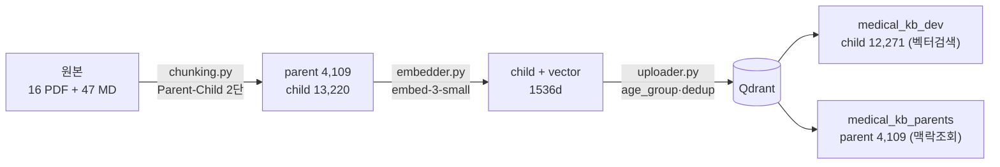
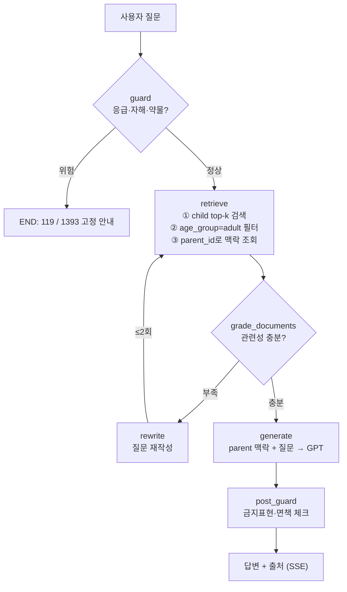

# RAG 인덱싱 파이프라인 (`src/rag_indexing/`)

> 만성콩팥병(CKD) 의료 가이드라인 RAG의 **인덱싱 트랙**.
> 원본 문서(가이드라인 PDF·환자교육 MD)를 청킹·임베딩해 **Qdrant 벡터 DB에 적재**한다.
> 추론 트랙(질문→검색→생성)은 `ai_worker/rag/`에서 별도로 구현한다 (Phase 4, 미구현).

**최종 갱신**: 2026-05-30 · 인덱싱 ✅ / 추론 ✅ (Phase 4 완료) / API·평가 ⏳ Phase 5~6

---

## 전체 RAG 워크플로우

RAG는 실행 주기가 다른 **두 파이프라인**으로 나뉘고, 둘은 **Qdrant에서 만난다** — 인덱싱이 *채우고*, 추론이 *검색*한다.

### Part 1 · 인덱싱 (오프라인 배치) — 본 패키지 ✅



### Part 2 · 추론 (온라인 런타임) — `ai_worker/rag/` ✅ Phase 4 완료



> 전 과정 **Langfuse 트레이싱**(Trace › Span › Generation, PII 마스킹). 추론 그래프는 LangGraph StateGraph(Self-corrective RAG)로 구성한다.

**설계 핵심**
- **두 파이프라인 분리** — 인덱싱은 자료 갱신 시 1회(배치), 추론은 매 질문(서비스). 접점은 오직 Qdrant.
- **Parent-Child** — 작은 child(400자)로 정밀 *검색*, 큰 parent(2000자)로 넓은 *맥락* 답변. 검색 정밀도와 답변 맥락의 트레이드오프 해소.
- **Self-corrective** — 검색이 부실하면 `rewrite`로 질문을 고쳐 재검색(≤2회). 의료 환각 방지.

---

## 현재 구현 상태 (2026-05-30)

| 단계 | 산출물 | 상태 |
|---|---|---|
| 청킹 | `chunking.py` → `chunks/*.jsonl` | ✅ |
| 임베딩 | `embedder.py` → `chunks/embedded_child_chunks.jsonl` | ✅ |
| 업로드 | `qdrant_uploader.py` → Qdrant 2 collection | ✅ |
| 검증 | 골든질문 검색 스모크 3/3 정확 | ✅ |
| 추론 | `ai_worker/rag/` LangGraph 8노드 + 안전가드 | ✅ (스모크 3/3) |

**실측**: child 13,220 → dedup 후 **12,271** 적재 / parent **4,109** / 임베딩 비용 **$0.031**(dev).

---

## 구성 파일

| 파일 | 책임 (SRP) |
|---|---|
| `config.py` | 전역 상수 **단일 진실** — 경로·doc_type·청크 크기·모델·age_group 규칙·언어 임계·collection 이름 |
| `chunking.py` | Parent-Child 2단 청킹 (PDF/MD 분기). 언어 ko/en **자동판정**·PDF **동적 카운트**·인코딩·인용·page 정리 |
| `embedder.py` | OpenAI 임베딩 (배치·재시도·차원검증·순서보존) + `--dry-run` |
| `qdrant_uploader.py` | age_group 태깅·text-hash dedup·point_id 변환·Qdrant 업로드 + `--dry-run` |
| `run_indexing.py` | **통합 진입점** — 위 3단(청킹→임베딩→업로드)을 순차 실행 (`--dry-run`·`--stage`·`--prod`·`--yes`) |
| `probe_headers.py` | (1회성) PDF/MD 헤더 구조 실측 — 청킹 분기 근거 |
| `sources/scrape_nosmokeguide.py` | 금연가이드 MD 스크래퍼 |
| `test_chunking.py` · `test_embedder.py` · `test_uploader.py` | 단위 테스트 **60개** (네트워크·키 불요, mock·dry-run) |

> `data/`(원본 PDF)·`chunks/`(생성물 JSONL)는 `.gitignore` — 코드+출처 명세만으로 재생성 가능(재현성).

---

## 데이터

- **원본**: 16 PDF(SKIP 2: 소아청소년편·CKRT → 인덱싱 14) + 47 MD (생활습관 5축: 식단·운동·수면·수분·스트레스)
- **doc_type**: `clinical`(KDIGO·KSN 진료지침) · `nutrition`(영양·환자교육) · `lifestyle`(생활습관)
- **language**: KDIGO 4종 + ISN 운동 합의문 = `en`, 나머지 국문 = `ko`
- 원본 출처·다운로드 방법은 인덱싱 자료 인벤토리 문서 참조 (저작권상 PDF는 레포 미포함, 각자 다운로드)

---

## 파이프라인 실행

### 자료 추가 → 재인덱싱 (2026-06-02 자동화)

새 가이드라인·교육자료를 추가할 때:

1. **파일을 카테고리 폴더에 넣는다** — `data/{kdigo|ksn_guideline|knsn|lifestyle}/`
   (또는 MD 하위폴더 `lifestyle/{nosmokeguide|alcohol|sleep|stress}/`)
2. **통합 실행** — 끝.
   ```bash
   python ../src/rag_indexing/run_indexing.py            # 청킹→임베딩→업로드 (전체 재구축)
   python ../src/rag_indexing/run_indexing.py --dry-run  # 키·Docker 불요, 구조만 검증 (실제 산출물 보존)
   ```

**config 수정이 필요 없는 이유** (자료가 늘어도 손 안 댐):
- **언어 ko/en** = `chunking.detect_language` 가 텍스트 한글 비율로 자동 판정 (`EN_PDF_STEMS` 폐지)
- **PDF 개수** = `collect_pdfs` 가 동적 카운트 + glob별 ≥1 매치만 검증 (`EXPECTED_*` 폐지)

**예외 — 단 1줄만 수동**: 완전히 **새로운 카테고리 폴더**(예: `pubmed/`)를 만들 때만
`config.DOC_TYPE_BY_FOLDER` 에 `"pubmed": "clinical"` 한 줄 + `PDF_GLOBS`(또는 `MD_GLOBS`)에 glob 을
추가한다 (폴더명만으론 clinical/nutrition 을 의미적으로 구분할 수 없어 자동화 대상에서 제외).

> ⚠️ 증분이 아니라 **전량 재구축**이다 — `--recreate` 가 collection 을 비우고 다시 적재한다
> (dev 임베딩 ≈ $0.03 라 단순·안전을 택함). 부분 실행은 `--stage chunk|embed|upload`.

### 사전 준비 (1회)
```bash
# 1) Qdrant 기동 (추론·업로드용 벡터 DB)
docker compose up -d qdrant            # 대시보드 http://localhost:6333/dashboard

# 2) OpenAI 키 입력 (임베딩용) — envs/.local.env 의 OPENAI_API_KEY
#    (.gitignore 보호됨. embedder 가 자동 탐색)

# 3) 의존성 (poc/.venv 에 설치되어 있음: openai·qdrant-client·pymupdf4llm·tiktoken)
cd poc && source .venv/bin/activate
```

### 인덱싱 3단 (순서대로)
```bash
# ① 청킹 — 원본 → chunks/child_chunks.jsonl + parent_chunks.jsonl (키·docker 불요)
python ../src/rag_indexing/chunking.py
python ../src/rag_indexing/chunking.py --dry-run     # 통계만

# ② 임베딩 — child → embedded_child_chunks.jsonl (+vector). 키 필요
python ../src/rag_indexing/embedder.py               # 전체 (약 $0.03)
python ../src/rag_indexing/embedder.py --limit 50    # 스모크
python ../src/rag_indexing/embedder.py --dry-run     # 키 없이 구조 검증

# ③ 업로드 — Qdrant 적재 (age_group 태깅·dedup). docker 필요
python ../src/rag_indexing/qdrant_uploader.py --recreate
python ../src/rag_indexing/qdrant_uploader.py --dry-run   # docker 없이 통계
```

### 테스트
```bash
python ../src/rag_indexing/test_chunking.py    # 27
python ../src/rag_indexing/test_embedder.py    # 16
python ../src/rag_indexing/test_uploader.py    # 14
# pytest 설치 시: python -m pytest ../src/rag_indexing/ -v
```

---

## Qdrant collection 구조

| collection | 내용 | 벡터 | 용도 |
|---|---|---|---|
| `medical_kb_dev` | child 12,271 | embed-3-small 1536d, Cosine | 정밀 검색 |
| `medical_kb_prod` | child | embed-3-large 3072d | (배포) |
| `medical_kb_parents` | parent 4,109 | **없음** (payload-only) | `parent_id`로 맥락 조회 |

- **point id**: 16-hex chunk id → `int(hex,16)` u64 변환 (Qdrant는 정수/UUID만 허용). payload에 원본 `chunk_id` 보존.
- **payload**: `doc_type·source·language·h1·h2·page·parent_id·age_group·text`

---

## 처리 정책

- **언어 자동 판정 (2026-06-02)**: `payload.language`(ko/en)는 `chunking.detect_language` 가 문서 앞부분
  (`LANG_SAMPLE_CHARS=3000`)의 한글:라틴 글자 비율로 자동 결정한다(`KO_LANG_THRESHOLD=0.10`). 의료 자료는
  주 언어가 명확히 갈려 robust 하며, 영문/국문 자료 추가 시 config 무수정(`EN_PDF_STEMS` 폐지).
- **PDF 동적 카운트 (2026-06-02)**: `collect_pdfs` 는 개수를 하드코딩하지 않고 `PDF_GLOBS` 각각이
  최소 1건 매치하는지만 검증(빈 폴더·glob 오타로 인한 조용한 누락 방지). `EXPECTED_*` 폐지.
- **모델** (`project_api_model_policy`): dev `text-embedding-3-small`(1536d) / prod `text-embedding-3-large`(3072d). **차원 변경 시 collection 재구축 필수.**
- **age_group 태깅 (P1-4)**: 타겟은 40세+ 성인 CKD. 소아 콘텐츠(KSN 소아 챕터·KDIGO 소아 섹션, 134개)는 **드롭하지 않고** `age_group='pediatric'`으로 태깅(무손실) → retriever가 `age_group=adult`로 격리. 규칙은 `config.py` 단일 진실.
- **dedup (P1-5)**: child 정확중복 텍스트 949개 제거(첫 등장 유지). parent는 `parent_id` 참조 무결성 위해 dedup 안 함.

---

## 추론 (`ai_worker/rag/`) ✅ Phase 4 완료

검증된 retrieve 경로(child 검색 → `age_group=adult` 필터 → parent 조회)를 LangGraph StateGraph
8노드로 감쌌다: `guard → retrieve → grade → rewrite(≤2) → generate → hallucination → answer_grade → post_guard`.
- `retriever.py`: 본 인덱스(`medical_kb_dev`/`medical_kb_parents`) qdrant-client 직접 검색
- `safety_guard.py`: 응급(119)·자해(1393)·약물·진단·eGFR<30 차단 + 금지표현 검출 (05 명세)
- 통합 스모크 3/3, 단위 24 (`ai_worker/rag/test_*.py`)
- 실행: `from ai_worker.rag import run` → `run("질문", user_context={"eGFR":50})`

## 다음 — Phase 5~6

- **Phase 5**: `POST /api/v1/chat/messages` + Redis Stream + SSE + `ai_worker/main.py` task consumer
- **Phase 6**: 평가셋(정확도·출처 인용률)·Langfuse 실통합·near-duplicate dedup 강화
